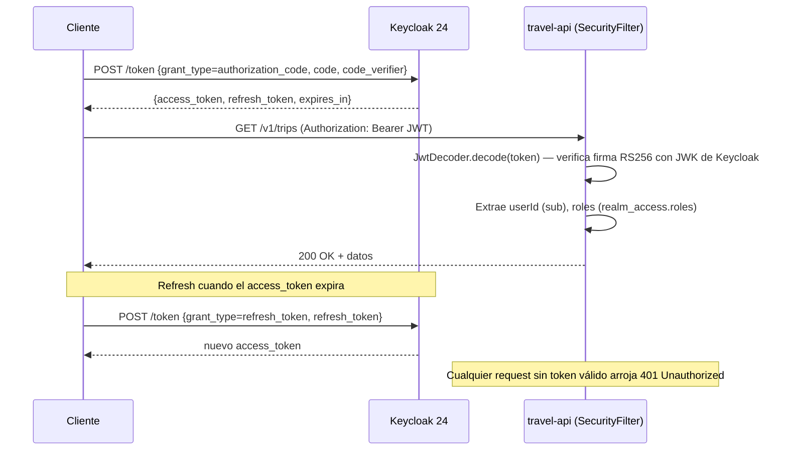

# Autenticación (Keycloak OAuth2)

```mermaid
sequenceDiagram
    participant C as Cliente
    participant K as Keycloak 24
    participant API as travel-api (SecurityFilter)

    C->>K: POST /token {grant_type=authorization_code, code, code_verifier}
    K-->>C: {access_token, refresh_token, expires_in}
    C->>API: GET /v1/trips (Authorization: Bearer JWT)
    API->>API: JwtDecoder.decode(token) — verifica firma RS256 con JWK de Keycloak
    API->>API: Extrae userId (sub), roles (realm_access.roles)
    API-->>C: 200 OK + datos

    Note over C,K: Refresh cuando el access_token expira
    C->>K: POST /token {grant_type=refresh_token, refresh_token}
    K-->>C: nuevo access_token

    Note over API: Cualquier request sin token válido arroja 401 Unauthorized
```
