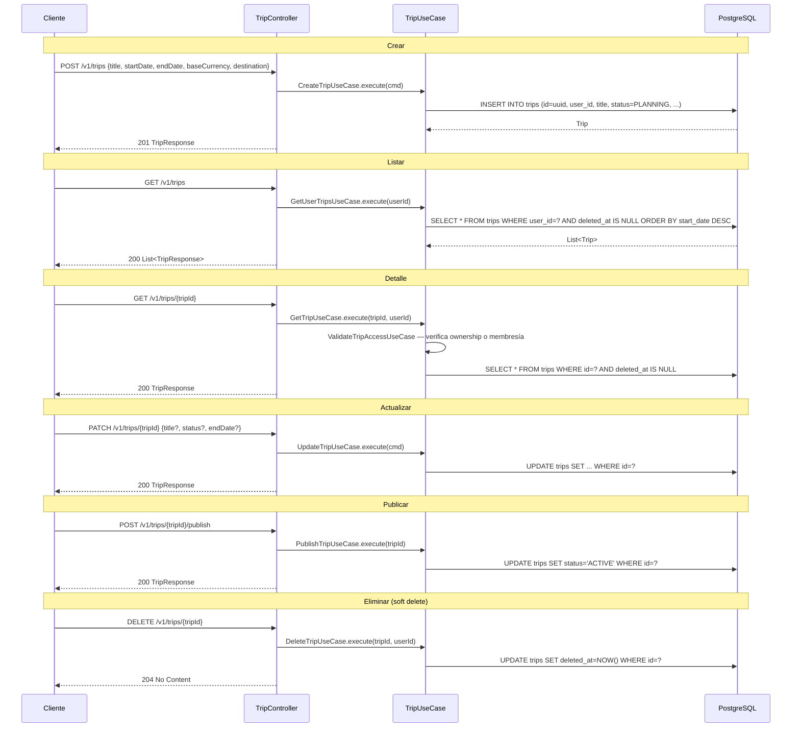

# Gestión de Viajes (Trip CRUD)

```mermaid
sequenceDiagram
    participant C as Cliente
    participant CTRL as TripController
    participant UC as TripUseCase
    participant DB as PostgreSQL

    Note over C,DB: Crear
    C->>CTRL: POST /v1/trips {title, startDate, endDate, baseCurrency, destination}
    CTRL->>UC: CreateTripUseCase.execute(cmd)
    UC->>DB: INSERT INTO trips (id=uuid, user_id, title, status=PLANNING, ...)
    DB-->>UC: Trip
    CTRL-->>C: 201 TripResponse

    Note over C,DB: Listar
    C->>CTRL: GET /v1/trips
    CTRL->>UC: GetUserTripsUseCase.execute(userId)
    UC->>DB: SELECT * FROM trips WHERE user_id=? AND deleted_at IS NULL ORDER BY start_date DESC
    DB-->>UC: List<Trip>
    CTRL-->>C: 200 List<TripResponse>

    Note over C,DB: Detalle
    C->>CTRL: GET /v1/trips/{tripId}
    CTRL->>UC: GetTripUseCase.execute(tripId, userId)
    UC->>UC: ValidateTripAccessUseCase — verifica ownership o membresía
    UC->>DB: SELECT * FROM trips WHERE id=? AND deleted_at IS NULL
    CTRL-->>C: 200 TripResponse

    Note over C,DB: Actualizar
    C->>CTRL: PATCH /v1/trips/{tripId} {title?, status?, endDate?}
    CTRL->>UC: UpdateTripUseCase.execute(cmd)
    UC->>DB: UPDATE trips SET ... WHERE id=?
    CTRL-->>C: 200 TripResponse

    Note over C,DB: Publicar
    C->>CTRL: POST /v1/trips/{tripId}/publish
    CTRL->>UC: PublishTripUseCase.execute(tripId)
    UC->>DB: UPDATE trips SET status='ACTIVE' WHERE id=?
    CTRL-->>C: 200 TripResponse

    Note over C,DB: Eliminar (soft delete)
    C->>CTRL: DELETE /v1/trips/{tripId}
    CTRL->>UC: DeleteTripUseCase.execute(tripId, userId)
    UC->>DB: UPDATE trips SET deleted_at=NOW() WHERE id=?
    CTRL-->>C: 204 No Content
```
