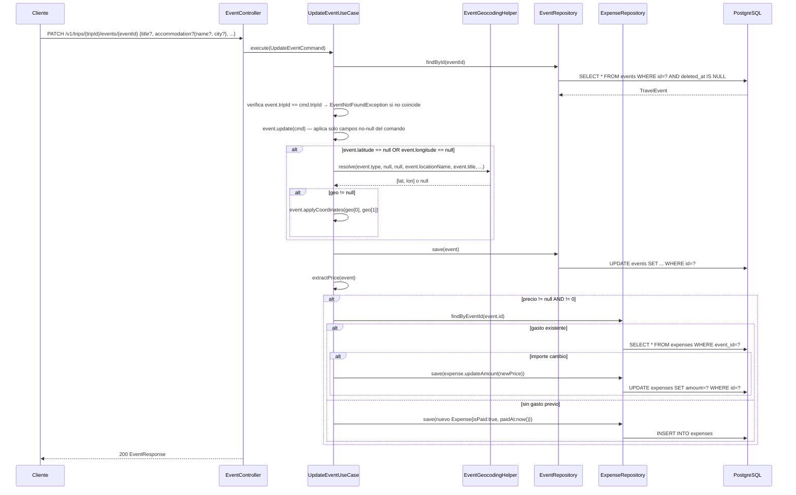

# Actualizar Evento (geocodificación condicional + sync de gasto)

```mermaid
sequenceDiagram
    participant C as Cliente
    participant CTRL as EventController
    participant UUC as UpdateEventUseCase
    participant GEO as EventGeocodingHelper
    participant REPO as EventRepository
    participant EXP as ExpenseRepository
    participant DB as PostgreSQL

    C->>CTRL: PATCH /v1/trips/{tripId}/events/{eventId} {title?, accommodation?{name?, city?}, ...}
    CTRL->>UUC: execute(UpdateEventCommand)
    UUC->>REPO: findById(eventId)
    REPO->>DB: SELECT * FROM events WHERE id=? AND deleted_at IS NULL
    DB-->>REPO: TravelEvent
    UUC->>UUC: verifica event.tripId == cmd.tripId → EventNotFoundException si no coincide
    UUC->>UUC: event.update(cmd) — aplica solo campos no-null del comando

    alt event.latitude == null OR event.longitude == null
        UUC->>GEO: resolve(event.type, null, null, event.locationName, event.title, ...)
        GEO-->>UUC: [lat, lon] o null
        alt geo != null
            UUC->>UUC: event.applyCoordinates(geo[0], geo[1])
        end
    end

    UUC->>REPO: save(event)
    REPO->>DB: UPDATE events SET ... WHERE id=?

    UUC->>UUC: extractPrice(event)
    alt precio != null AND != 0
        UUC->>EXP: findByEventId(event.id)
        alt gasto existente
            EXP->>DB: SELECT * FROM expenses WHERE event_id=?
            alt importe cambio
                UUC->>EXP: save(expense.updateAmount(newPrice))
                EXP->>DB: UPDATE expenses SET amount=? WHERE id=?
            end
        else sin gasto previo
            UUC->>EXP: save(nuevo Expense{isPaid:true, paidAt:now()})
            EXP->>DB: INSERT INTO expenses
        end
    end

    CTRL-->>C: 200 EventResponse
```
