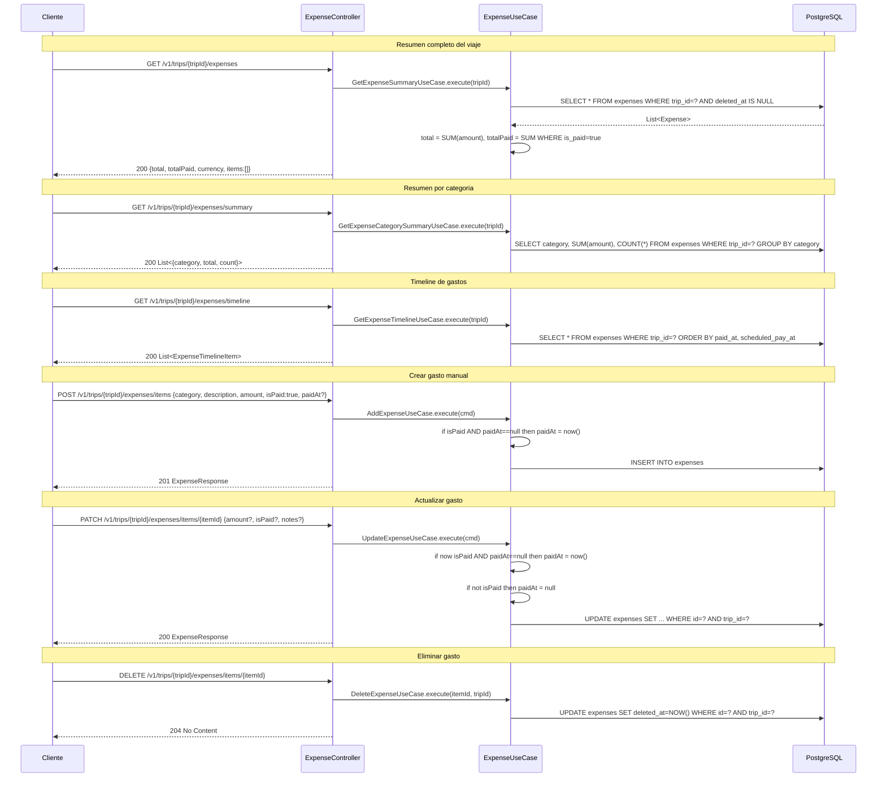

# Gestión de Gastos (Expenses)

```mermaid
sequenceDiagram
    participant C as Cliente
    participant CTRL as ExpenseController
    participant UC as ExpenseUseCase
    participant DB as PostgreSQL

    Note over C,DB: Resumen completo del viaje
    C->>CTRL: GET /v1/trips/{tripId}/expenses
    CTRL->>UC: GetExpenseSummaryUseCase.execute(tripId)
    UC->>DB: SELECT * FROM expenses WHERE trip_id=? AND deleted_at IS NULL
    DB-->>UC: List<Expense>
    UC->>UC: total = SUM(amount), totalPaid = SUM WHERE is_paid=true
    CTRL-->>C: 200 {total, totalPaid, currency, items:[]}

    Note over C,DB: Resumen por categoria
    C->>CTRL: GET /v1/trips/{tripId}/expenses/summary
    CTRL->>UC: GetExpenseCategorySummaryUseCase.execute(tripId)
    UC->>DB: SELECT category, SUM(amount), COUNT(*) FROM expenses WHERE trip_id=? GROUP BY category
    CTRL-->>C: 200 List<{category, total, count}>

    Note over C,DB: Timeline de gastos
    C->>CTRL: GET /v1/trips/{tripId}/expenses/timeline
    CTRL->>UC: GetExpenseTimelineUseCase.execute(tripId)
    UC->>DB: SELECT * FROM expenses WHERE trip_id=? ORDER BY paid_at, scheduled_pay_at
    CTRL-->>C: 200 List<ExpenseTimelineItem>

    Note over C,DB: Crear gasto manual
    C->>CTRL: POST /v1/trips/{tripId}/expenses/items {category, description, amount, isPaid:true, paidAt?}
    CTRL->>UC: AddExpenseUseCase.execute(cmd)
    UC->>UC: if isPaid AND paidAt==null then paidAt = now()
    UC->>DB: INSERT INTO expenses
    CTRL-->>C: 201 ExpenseResponse

    Note over C,DB: Actualizar gasto
    C->>CTRL: PATCH /v1/trips/{tripId}/expenses/items/{itemId} {amount?, isPaid?, notes?}
    CTRL->>UC: UpdateExpenseUseCase.execute(cmd)
    UC->>UC: if now isPaid AND paidAt==null then paidAt = now()
    UC->>UC: if not isPaid then paidAt = null
    UC->>DB: UPDATE expenses SET ... WHERE id=? AND trip_id=?
    CTRL-->>C: 200 ExpenseResponse

    Note over C,DB: Eliminar gasto
    C->>CTRL: DELETE /v1/trips/{tripId}/expenses/items/{itemId}
    CTRL->>UC: DeleteExpenseUseCase.execute(itemId, tripId)
    UC->>DB: UPDATE expenses SET deleted_at=NOW() WHERE id=? AND trip_id=?
    CTRL-->>C: 204 No Content
```
