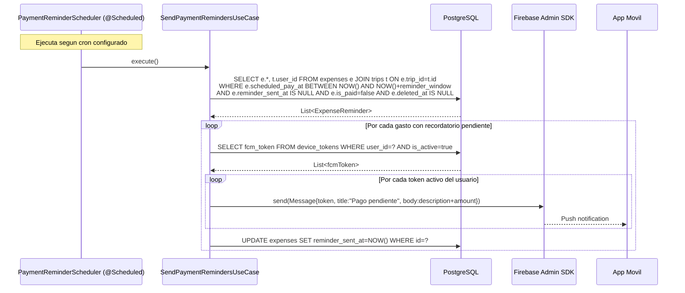

# Recordatorios de Pago (Scheduler)

```mermaid
sequenceDiagram
    participant SCHED as PaymentReminderScheduler (@Scheduled)
    participant UC as SendPaymentRemindersUseCase
    participant DB as PostgreSQL
    participant FCM as Firebase Admin SDK
    participant APP as App Movil

    Note over SCHED: Ejecuta segun cron configurado
    SCHED->>UC: execute()
    UC->>DB: SELECT e.*, t.user_id FROM expenses e JOIN trips t ON e.trip_id=t.id<br/>WHERE e.scheduled_pay_at BETWEEN NOW() AND NOW()+reminder_window<br/>AND e.reminder_sent_at IS NULL AND e.is_paid=false AND e.deleted_at IS NULL
    DB-->>UC: List<ExpenseReminder>

    loop Por cada gasto con recordatorio pendiente
        UC->>DB: SELECT fcm_token FROM device_tokens WHERE user_id=? AND is_active=true
        DB-->>UC: List<fcmToken>
        loop Por cada token activo del usuario
            UC->>FCM: send(Message{token, title:"Pago pendiente", body:description+amount})
            FCM-->>APP: Push notification
        end
        UC->>DB: UPDATE expenses SET reminder_sent_at=NOW() WHERE id=?
    end
```
