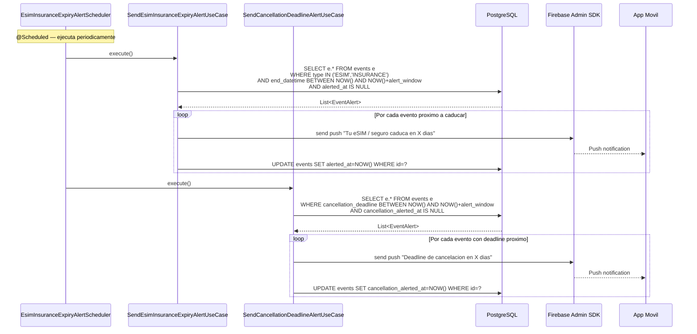

# Alertas de Caducidad eSIM/Seguro y Deadline de Cancelación

```mermaid
sequenceDiagram
    participant SCHED as EsimInsuranceExpiryAlertScheduler
    participant UC1 as SendEsimInsuranceExpiryAlertUseCase
    participant UC2 as SendCancellationDeadlineAlertUseCase
    participant DB as PostgreSQL
    participant FCM as Firebase Admin SDK
    participant APP as App Movil

    Note over SCHED: @Scheduled — ejecuta periodicamente
    SCHED->>UC1: execute()
    UC1->>DB: SELECT e.* FROM events e<br/>WHERE type IN ('ESIM','INSURANCE')<br/>AND end_datetime BETWEEN NOW() AND NOW()+alert_window<br/>AND alerted_at IS NULL
    DB-->>UC1: List<EventAlert>
    loop Por cada evento proximo a caducar
        UC1->>FCM: send push "Tu eSIM / seguro caduca en X dias"
        FCM-->>APP: Push notification
        UC1->>DB: UPDATE events SET alerted_at=NOW() WHERE id=?
    end

    SCHED->>UC2: execute()
    UC2->>DB: SELECT e.* FROM events e<br/>WHERE cancellation_deadline BETWEEN NOW() AND NOW()+alert_window<br/>AND cancellation_alerted_at IS NULL
    DB-->>UC2: List<EventAlert>
    loop Por cada evento con deadline proximo
        UC2->>FCM: send push "Deadline de cancelacion en X dias"
        FCM-->>APP: Push notification
        UC2->>DB: UPDATE events SET cancellation_alerted_at=NOW() WHERE id=?
    end
```
