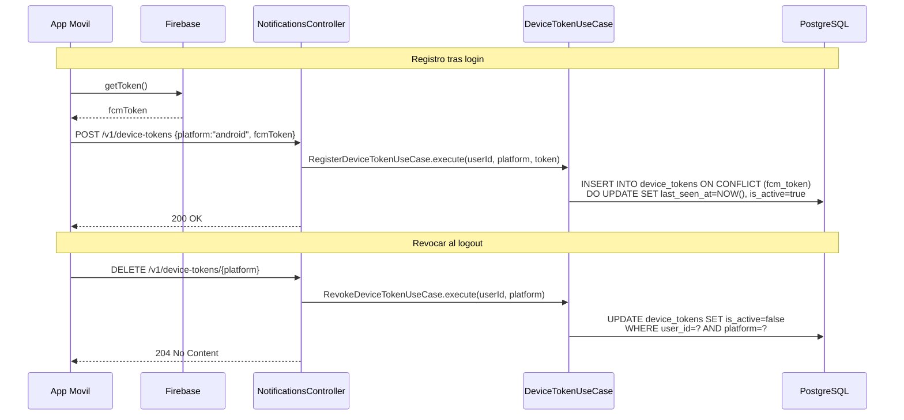

# Device Tokens (FCM Push)

```mermaid
sequenceDiagram
    participant APP as App Movil
    participant FCM as Firebase
    participant CTRL as NotificationsController
    participant UC as DeviceTokenUseCase
    participant DB as PostgreSQL

    Note over APP,DB: Registro tras login
    APP->>FCM: getToken()
    FCM-->>APP: fcmToken
    APP->>CTRL: POST /v1/device-tokens {platform:"android", fcmToken}
    CTRL->>UC: RegisterDeviceTokenUseCase.execute(userId, platform, token)
    UC->>DB: INSERT INTO device_tokens ON CONFLICT (fcm_token)<br/>DO UPDATE SET last_seen_at=NOW(), is_active=true
    CTRL-->>APP: 200 OK

    Note over APP,DB: Revocar al logout
    APP->>CTRL: DELETE /v1/device-tokens/{platform}
    CTRL->>UC: RevokeDeviceTokenUseCase.execute(userId, platform)
    UC->>DB: UPDATE device_tokens SET is_active=false<br/>WHERE user_id=? AND platform=?
    CTRL-->>APP: 204 No Content
```
