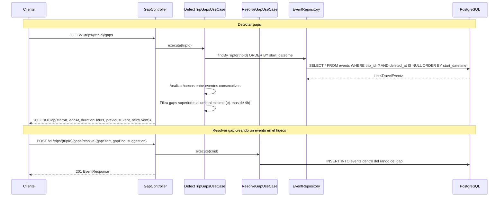

# Gaps de Itinerario

```mermaid
sequenceDiagram
    participant C as Cliente
    participant CTRL as GapController
    participant DUC as DetectTripGapsUseCase
    participant RUC as ResolveGapUseCase
    participant REPO as EventRepository
    participant DB as PostgreSQL

    Note over C,DB: Detectar gaps
    C->>CTRL: GET /v1/trips/{tripId}/gaps
    CTRL->>DUC: execute(tripId)
    DUC->>REPO: findByTripId(tripId) ORDER BY start_datetime
    REPO->>DB: SELECT * FROM events WHERE trip_id=? AND deleted_at IS NULL ORDER BY start_datetime
    DB-->>REPO: List<TravelEvent>
    DUC->>DUC: Analiza huecos entre eventos consecutivos
    DUC->>DUC: Filtra gaps superiores al umbral minimo (ej. mas de 4h)
    CTRL-->>C: 200 List<Gap{startAt, endAt, durationHours, previousEvent, nextEvent}>

    Note over C,DB: Resolver gap creando un evento en el hueco
    C->>CTRL: POST /v1/trips/{tripId}/gaps/resolve {gapStart, gapEnd, suggestion}
    CTRL->>RUC: execute(cmd)
    RUC->>DB: INSERT INTO events dentro del rango del gap
    CTRL-->>C: 201 EventResponse
```
