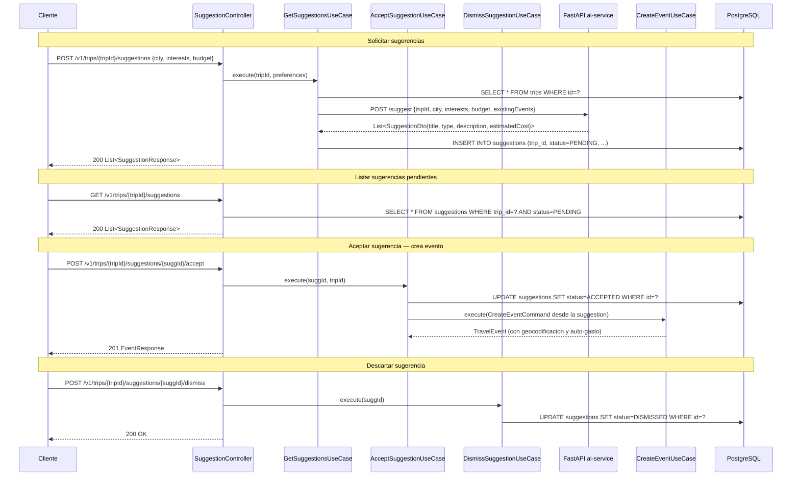

# Sugerencias AI

```mermaid
sequenceDiagram
    participant C as Cliente
    participant CTRL as SuggestionController
    participant GUC as GetSuggestionsUseCase
    participant AUC as AcceptSuggestionUseCase
    participant DUC as DismissSuggestionUseCase
    participant AI as FastAPI ai-service
    participant CUC as CreateEventUseCase
    participant DB as PostgreSQL

    Note over C,DB: Solicitar sugerencias
    C->>CTRL: POST /v1/trips/{tripId}/suggestions {city, interests, budget}
    CTRL->>GUC: execute(tripId, preferences)
    GUC->>DB: SELECT * FROM trips WHERE id=?
    GUC->>AI: POST /suggest {tripId, city, interests, budget, existingEvents}
    AI-->>GUC: List<SuggestionDto{title, type, description, estimatedCost}>
    GUC->>DB: INSERT INTO suggestions (trip_id, status=PENDING, ...)
    CTRL-->>C: 200 List<SuggestionResponse>

    Note over C,DB: Listar sugerencias pendientes
    C->>CTRL: GET /v1/trips/{tripId}/suggestions
    CTRL->>DB: SELECT * FROM suggestions WHERE trip_id=? AND status=PENDING
    CTRL-->>C: 200 List<SuggestionResponse>

    Note over C,DB: Aceptar sugerencia — crea evento
    C->>CTRL: POST /v1/trips/{tripId}/suggestions/{suggId}/accept
    CTRL->>AUC: execute(suggId, tripId)
    AUC->>DB: UPDATE suggestions SET status=ACCEPTED WHERE id=?
    AUC->>CUC: execute(CreateEventCommand desde la suggestion)
    CUC-->>AUC: TravelEvent (con geocodificacion y auto-gasto)
    CTRL-->>C: 201 EventResponse

    Note over C,DB: Descartar sugerencia
    C->>CTRL: POST /v1/trips/{tripId}/suggestions/{suggId}/dismiss
    CTRL->>DUC: execute(suggId)
    DUC->>DB: UPDATE suggestions SET status=DISMISSED WHERE id=?
    CTRL-->>C: 200 OK
```
