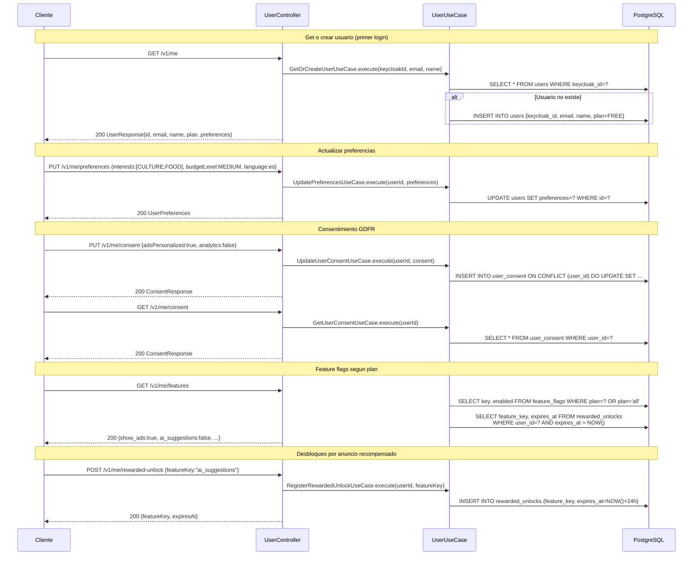

# Perfil de Usuario, Preferencias, Consentimiento y Features

```mermaid
sequenceDiagram
    participant C as Cliente
    participant CTRL as UserController
    participant UC as UserUseCase
    participant DB as PostgreSQL

    Note over C,DB: Get o crear usuario (primer login)
    C->>CTRL: GET /v1/me
    CTRL->>UC: GetOrCreateUserUseCase.execute(keycloakId, email, name)
    UC->>DB: SELECT * FROM users WHERE keycloak_id=?
    alt Usuario no existe
        UC->>DB: INSERT INTO users {keycloak_id, email, name, plan=FREE}
    end
    CTRL-->>C: 200 UserResponse{id, email, name, plan, preferences}

    Note over C,DB: Actualizar preferencias
    C->>CTRL: PUT /v1/me/preferences {interests:[CULTURE,FOOD], budgetLevel:MEDIUM, language:es}
    CTRL->>UC: UpdatePreferencesUseCase.execute(userId, preferences)
    UC->>DB: UPDATE users SET preferences=? WHERE id=?
    CTRL-->>C: 200 UserPreferences

    Note over C,DB: Consentimiento GDPR
    C->>CTRL: PUT /v1/me/consent {adsPersonalized:true, analytics:false}
    CTRL->>UC: UpdateUserConsentUseCase.execute(userId, consent)
    UC->>DB: INSERT INTO user_consent ON CONFLICT (user_id) DO UPDATE SET ...
    CTRL-->>C: 200 ConsentResponse

    C->>CTRL: GET /v1/me/consent
    CTRL->>UC: GetUserConsentUseCase.execute(userId)
    UC->>DB: SELECT * FROM user_consent WHERE user_id=?
    CTRL-->>C: 200 ConsentResponse

    Note over C,DB: Feature flags segun plan
    C->>CTRL: GET /v1/me/features
    UC->>DB: SELECT key, enabled FROM feature_flags WHERE plan=? OR plan='all'
    UC->>DB: SELECT feature_key, expires_at FROM rewarded_unlocks<br/>WHERE user_id=? AND expires_at > NOW()
    CTRL-->>C: 200 {show_ads:true, ai_suggestions:false, ...}

    Note over C,DB: Desbloqueo por anuncio recompensado
    C->>CTRL: POST /v1/me/rewarded-unlock {featureKey:"ai_suggestions"}
    CTRL->>UC: RegisterRewardedUnlockUseCase.execute(userId, featureKey)
    UC->>DB: INSERT INTO rewarded_unlocks {feature_key, expires_at=NOW()+24h}
    CTRL-->>C: 200 {featureKey, expiresAt}
```
