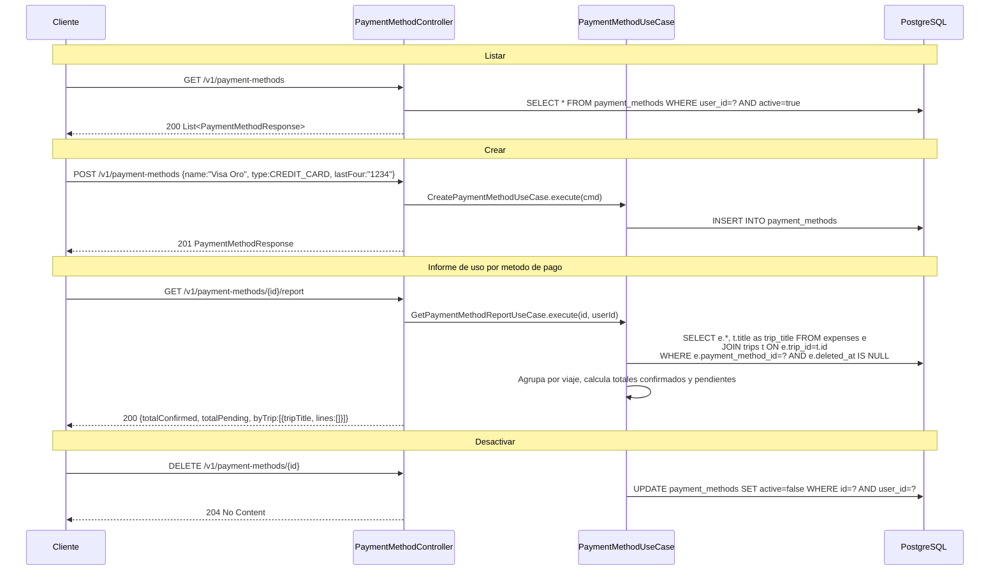

# Métodos de Pago

```mermaid
sequenceDiagram
    participant C as Cliente
    participant CTRL as PaymentMethodController
    participant UC as PaymentMethodUseCase
    participant DB as PostgreSQL

    Note over C,DB: Listar
    C->>CTRL: GET /v1/payment-methods
    CTRL->>DB: SELECT * FROM payment_methods WHERE user_id=? AND active=true
    CTRL-->>C: 200 List<PaymentMethodResponse>

    Note over C,DB: Crear
    C->>CTRL: POST /v1/payment-methods {name:"Visa Oro", type:CREDIT_CARD, lastFour:"1234"}
    CTRL->>UC: CreatePaymentMethodUseCase.execute(cmd)
    UC->>DB: INSERT INTO payment_methods
    CTRL-->>C: 201 PaymentMethodResponse

    Note over C,DB: Informe de uso por metodo de pago
    C->>CTRL: GET /v1/payment-methods/{id}/report
    CTRL->>UC: GetPaymentMethodReportUseCase.execute(id, userId)
    UC->>DB: SELECT e.*, t.title as trip_title FROM expenses e<br/>JOIN trips t ON e.trip_id=t.id<br/>WHERE e.payment_method_id=? AND e.deleted_at IS NULL
    UC->>UC: Agrupa por viaje, calcula totales confirmados y pendientes
    CTRL-->>C: 200 {totalConfirmed, totalPending, byTrip:[{tripTitle, lines:[]}]}

    Note over C,DB: Desactivar
    C->>CTRL: DELETE /v1/payment-methods/{id}
    UC->>DB: UPDATE payment_methods SET active=false WHERE id=? AND user_id=?
    CTRL-->>C: 204 No Content
```
