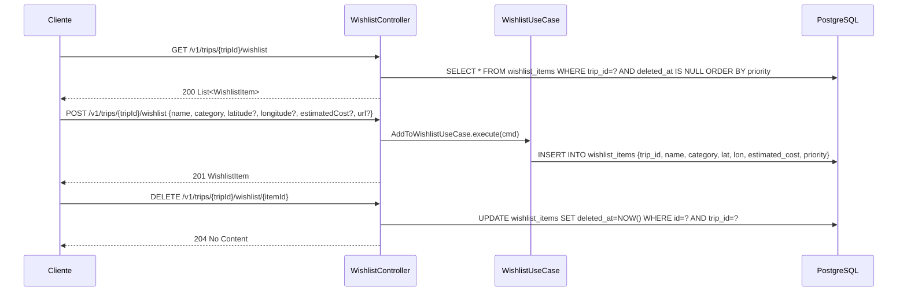

# Wishlist

```mermaid
sequenceDiagram
    participant C as Cliente
    participant CTRL as WishlistController
    participant UC as WishlistUseCase
    participant DB as PostgreSQL

    C->>CTRL: GET /v1/trips/{tripId}/wishlist
    CTRL->>DB: SELECT * FROM wishlist_items WHERE trip_id=? AND deleted_at IS NULL ORDER BY priority
    CTRL-->>C: 200 List<WishlistItem>

    C->>CTRL: POST /v1/trips/{tripId}/wishlist {name, category, latitude?, longitude?, estimatedCost?, url?}
    CTRL->>UC: AddToWishlistUseCase.execute(cmd)
    UC->>DB: INSERT INTO wishlist_items {trip_id, name, category, lat, lon, estimated_cost, priority}
    CTRL-->>C: 201 WishlistItem

    C->>CTRL: DELETE /v1/trips/{tripId}/wishlist/{itemId}
    CTRL->>DB: UPDATE wishlist_items SET deleted_at=NOW() WHERE id=? AND trip_id=?
    CTRL-->>C: 204 No Content
```
