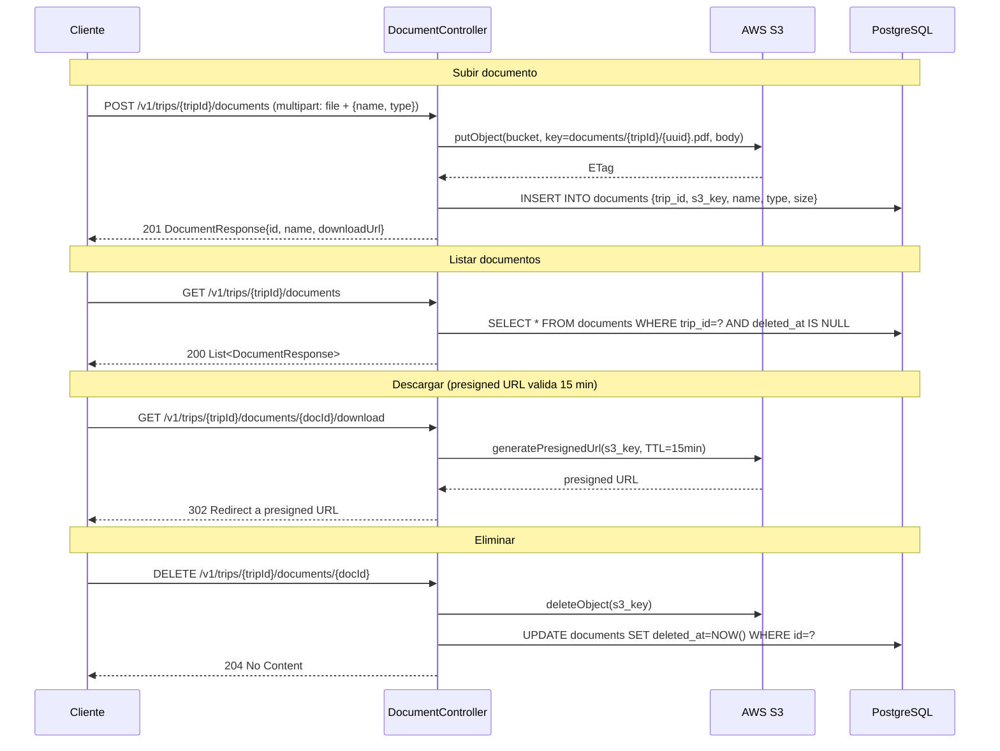

# Documentos (Document Vault)

```mermaid
sequenceDiagram
    participant C as Cliente
    participant CTRL as DocumentController
    participant S3 as AWS S3
    participant DB as PostgreSQL

    Note over C,DB: Subir documento
    C->>CTRL: POST /v1/trips/{tripId}/documents (multipart: file + {name, type})
    CTRL->>S3: putObject(bucket, key=documents/{tripId}/{uuid}.pdf, body)
    S3-->>CTRL: ETag
    CTRL->>DB: INSERT INTO documents {trip_id, s3_key, name, type, size}
    CTRL-->>C: 201 DocumentResponse{id, name, downloadUrl}

    Note over C,DB: Listar documentos
    C->>CTRL: GET /v1/trips/{tripId}/documents
    CTRL->>DB: SELECT * FROM documents WHERE trip_id=? AND deleted_at IS NULL
    CTRL-->>C: 200 List<DocumentResponse>

    Note over C,DB: Descargar (presigned URL valida 15 min)
    C->>CTRL: GET /v1/trips/{tripId}/documents/{docId}/download
    CTRL->>S3: generatePresignedUrl(s3_key, TTL=15min)
    S3-->>CTRL: presigned URL
    CTRL-->>C: 302 Redirect a presigned URL

    Note over C,DB: Eliminar
    C->>CTRL: DELETE /v1/trips/{tripId}/documents/{docId}
    CTRL->>S3: deleteObject(s3_key)
    CTRL->>DB: UPDATE documents SET deleted_at=NOW() WHERE id=?
    CTRL-->>C: 204 No Content
```
