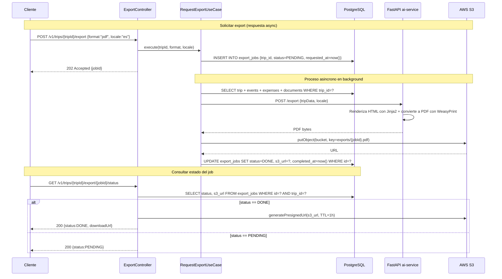

# Export PDF

```mermaid
sequenceDiagram
    participant C as Cliente
    participant CTRL as ExportController
    participant UC as RequestExportUseCase
    participant DB as PostgreSQL
    participant AI as FastAPI ai-service
    participant S3 as AWS S3

    Note over C,S3: Solicitar export (respuesta async)
    C->>CTRL: POST /v1/trips/{tripId}/export {format:"pdf", locale:"es"}
    CTRL->>UC: execute(tripId, format, locale)
    UC->>DB: INSERT INTO export_jobs {trip_id, status=PENDING, requested_at=now()}
    CTRL-->>C: 202 Accepted {jobId}

    Note over UC,S3: Proceso asincrono en background
    UC->>DB: SELECT trip + events + expenses + documents WHERE trip_id=?
    UC->>AI: POST /export {tripData, locale}
    AI->>AI: Renderiza HTML con Jinja2 + convierte a PDF con WeasyPrint
    AI-->>UC: PDF bytes
    UC->>S3: putObject(bucket, key=exports/{jobId}.pdf)
    S3-->>UC: URL
    UC->>DB: UPDATE export_jobs SET status=DONE, s3_url=?, completed_at=now() WHERE id=?

    Note over C,DB: Consultar estado del job
    C->>CTRL: GET /v1/trips/{tripId}/export/{jobId}/status
    CTRL->>DB: SELECT status, s3_url FROM export_jobs WHERE id=? AND trip_id=?
    alt status == DONE
        CTRL->>S3: generatePresignedUrl(s3_url, TTL=1h)
        CTRL-->>C: 200 {status:DONE, downloadUrl}
    else status == PENDING
        CTRL-->>C: 200 {status:PENDING}
    end
```
