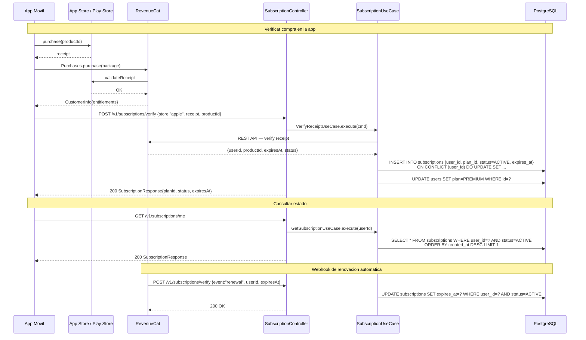

# Suscripciones (RevenueCat)

```mermaid
sequenceDiagram
    participant APP as App Movil
    participant Store as App Store / Play Store
    participant RC as RevenueCat
    participant CTRL as SubscriptionController
    participant UC as SubscriptionUseCase
    participant DB as PostgreSQL

    Note over APP,DB: Verificar compra en la app
    APP->>Store: purchase(productId)
    Store-->>APP: receipt
    APP->>RC: Purchases.purchase(package)
    RC->>Store: validateReceipt
    Store-->>RC: OK
    RC-->>APP: CustomerInfo{entitlements}
    APP->>CTRL: POST /v1/subscriptions/verify {store:"apple", receipt, productId}
    CTRL->>UC: VerifyReceiptUseCase.execute(cmd)
    UC->>RC: REST API — verify receipt
    RC-->>UC: {userId, productId, expiresAt, status}
    UC->>DB: INSERT INTO subscriptions {user_id, plan_id, status=ACTIVE, expires_at}<br/>ON CONFLICT (user_id) DO UPDATE SET ...
    UC->>DB: UPDATE users SET plan=PREMIUM WHERE id=?
    CTRL-->>APP: 200 SubscriptionResponse{planId, status, expiresAt}

    Note over APP,DB: Consultar estado
    APP->>CTRL: GET /v1/subscriptions/me
    CTRL->>UC: GetSubscriptionUseCase.execute(userId)
    UC->>DB: SELECT * FROM subscriptions WHERE user_id=? AND status=ACTIVE<br/>ORDER BY created_at DESC LIMIT 1
    CTRL-->>APP: 200 SubscriptionResponse

    Note over RC,DB: Webhook de renovacion automatica
    RC->>CTRL: POST /v1/subscriptions/verify {event:"renewal", userId, expiresAt}
    UC->>DB: UPDATE subscriptions SET expires_at=? WHERE user_id=? AND status=ACTIVE
    CTRL-->>RC: 200 OK
```
