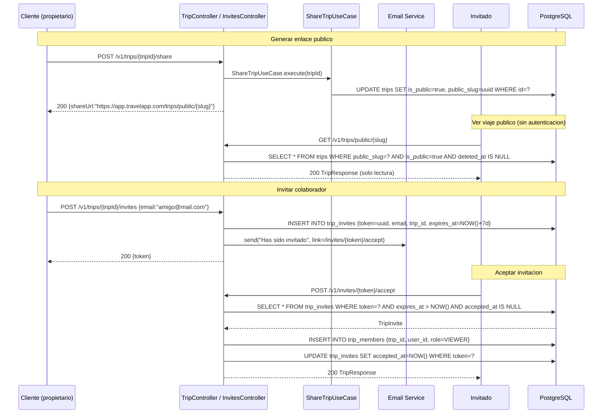

# Compartir Viaje e Invitaciones

```mermaid
sequenceDiagram
    participant C as Cliente (propietario)
    participant CTRL as TripController / InvitesController
    participant UC as ShareTripUseCase
    participant EMAIL as Email Service
    participant G as Invitado
    participant DB as PostgreSQL

    Note over C,DB: Generar enlace publico
    C->>CTRL: POST /v1/trips/{tripId}/share
    CTRL->>UC: ShareTripUseCase.execute(tripId)
    UC->>DB: UPDATE trips SET is_public=true, public_slug=uuid WHERE id=?
    CTRL-->>C: 200 {shareUrl:"https://app.travelapp.com/trips/public/{slug}"}

    Note over G,DB: Ver viaje publico (sin autenticacion)
    G->>CTRL: GET /v1/trips/public/{slug}
    CTRL->>DB: SELECT * FROM trips WHERE public_slug=? AND is_public=true AND deleted_at IS NULL
    CTRL-->>G: 200 TripResponse (solo lectura)

    Note over C,DB: Invitar colaborador
    C->>CTRL: POST /v1/trips/{tripId}/invites {email:"amigo@mail.com"}
    CTRL->>DB: INSERT INTO trip_invites {token=uuid, email, trip_id, expires_at=NOW()+7d}
    CTRL->>EMAIL: send("Has sido invitado", link=/invites/{token}/accept)
    CTRL-->>C: 200 {token}

    Note over G,DB: Aceptar invitacion
    G->>CTRL: POST /v1/invites/{token}/accept
    CTRL->>DB: SELECT * FROM trip_invites WHERE token=? AND expires_at > NOW() AND accepted_at IS NULL
    DB-->>CTRL: TripInvite
    CTRL->>DB: INSERT INTO trip_members {trip_id, user_id, role=VIEWER}
    CTRL->>DB: UPDATE trip_invites SET accepted_at=NOW() WHERE token=?
    CTRL-->>G: 200 TripResponse
```
