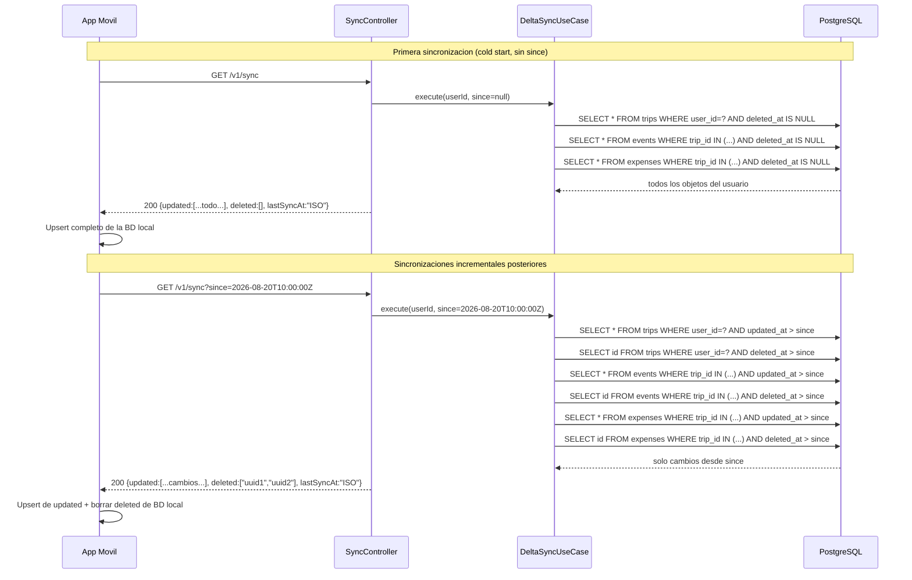

# Sync Delta (Mobile)

```mermaid
sequenceDiagram
    participant APP as App Movil
    participant CTRL as SyncController
    participant UC as DeltaSyncUseCase
    participant DB as PostgreSQL

    Note over APP,DB: Primera sincronizacion (cold start, sin since)
    APP->>CTRL: GET /v1/sync
    CTRL->>UC: execute(userId, since=null)
    UC->>DB: SELECT * FROM trips WHERE user_id=? AND deleted_at IS NULL
    UC->>DB: SELECT * FROM events WHERE trip_id IN (...) AND deleted_at IS NULL
    UC->>DB: SELECT * FROM expenses WHERE trip_id IN (...) AND deleted_at IS NULL
    DB-->>UC: todos los objetos del usuario
    CTRL-->>APP: 200 {updated:[...todo...], deleted:[], lastSyncAt:"ISO"}
    APP->>APP: Upsert completo de la BD local

    Note over APP,DB: Sincronizaciones incrementales posteriores
    APP->>CTRL: GET /v1/sync?since=2026-08-20T10:00:00Z
    CTRL->>UC: execute(userId, since=2026-08-20T10:00:00Z)
    UC->>DB: SELECT * FROM trips WHERE user_id=? AND updated_at > since
    UC->>DB: SELECT id FROM trips WHERE user_id=? AND deleted_at > since
    UC->>DB: SELECT * FROM events WHERE trip_id IN (...) AND updated_at > since
    UC->>DB: SELECT id FROM events WHERE trip_id IN (...) AND deleted_at > since
    UC->>DB: SELECT * FROM expenses WHERE trip_id IN (...) AND updated_at > since
    UC->>DB: SELECT id FROM expenses WHERE trip_id IN (...) AND deleted_at > since
    DB-->>UC: solo cambios desde since
    CTRL-->>APP: 200 {updated:[...cambios...], deleted:["uuid1","uuid2"], lastSyncAt:"ISO"}
    APP->>APP: Upsert de updated + borrar deleted de BD local
```
