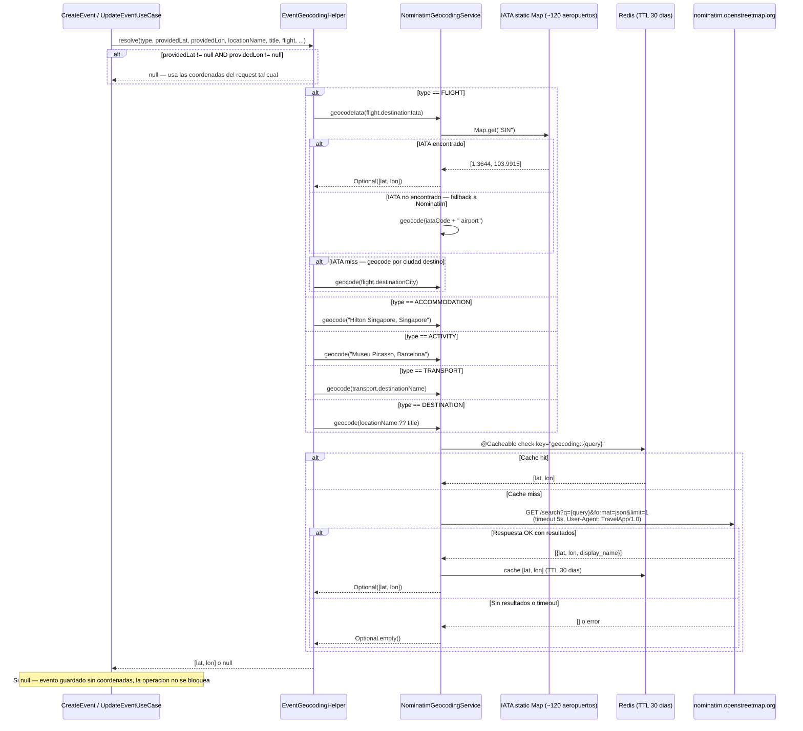

# Geocodificación (detalle interno)

```mermaid
sequenceDiagram
    participant UC as CreateEvent / UpdateEventUseCase
    participant HELPER as EventGeocodingHelper
    participant PORT as NominatimGeocodingService
    participant IATA as IATA static Map (~120 aeropuertos)
    participant REDIS as Redis (TTL 30 dias)
    participant NOM as nominatim.openstreetmap.org

    UC->>HELPER: resolve(type, providedLat, providedLon, locationName, title, flight, ...)

    alt providedLat != null AND providedLon != null
        HELPER-->>UC: null — usa las coordenadas del request tal cual
    end

    alt type == FLIGHT
        HELPER->>PORT: geocodeIata(flight.destinationIata)
        PORT->>IATA: Map.get("SIN")
        alt IATA encontrado
            IATA-->>PORT: [1.3644, 103.9915]
            PORT-->>HELPER: Optional([lat, lon])
        else IATA no encontrado — fallback a Nominatim
            PORT->>PORT: geocode(iataCode + " airport")
        end
        alt IATA miss — geocode por ciudad destino
            HELPER->>PORT: geocode(flight.destinationCity)
        end
    else type == ACCOMMODATION
        HELPER->>PORT: geocode("Hilton Singapore, Singapore")
    else type == ACTIVITY
        HELPER->>PORT: geocode("Museu Picasso, Barcelona")
    else type == TRANSPORT
        HELPER->>PORT: geocode(transport.destinationName)
    else type == DESTINATION
        HELPER->>PORT: geocode(locationName ?? title)
    end

    PORT->>REDIS: @Cacheable check key="geocoding::{query}"
    alt Cache hit
        REDIS-->>PORT: [lat, lon]
    else Cache miss
        PORT->>NOM: GET /search?q={query}&format=json&limit=1<br/>(timeout 5s, User-Agent: TravelApp/1.0)
        alt Respuesta OK con resultados
            NOM-->>PORT: [{lat, lon, display_name}]
            PORT->>REDIS: cache [lat, lon] (TTL 30 dias)
            PORT-->>HELPER: Optional([lat, lon])
        else Sin resultados o timeout
            NOM-->>PORT: [] o error
            PORT-->>HELPER: Optional.empty()
        end
    end

    HELPER-->>UC: [lat, lon] o null
    Note over UC: Si null — evento guardado sin coordenadas, la operacion no se bloquea
```
